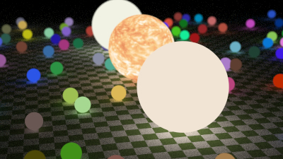
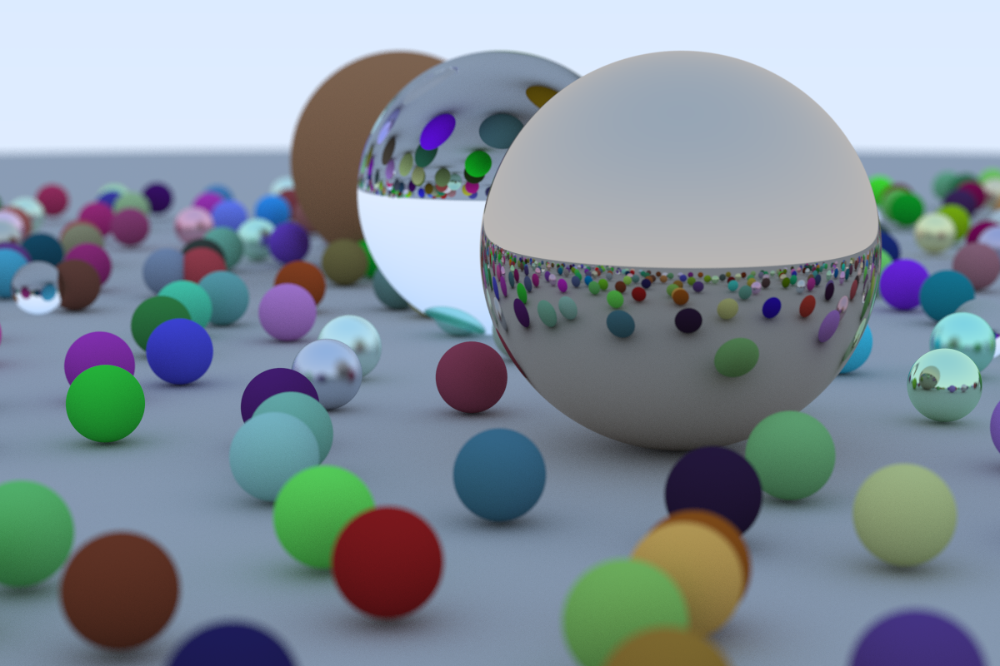
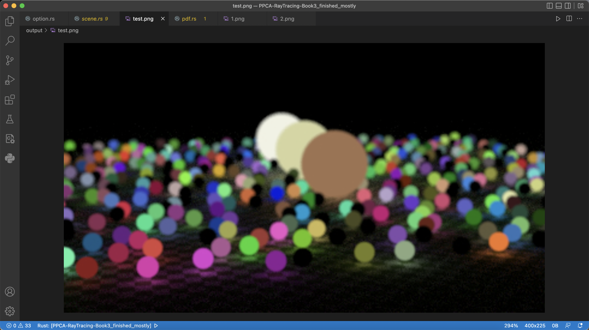
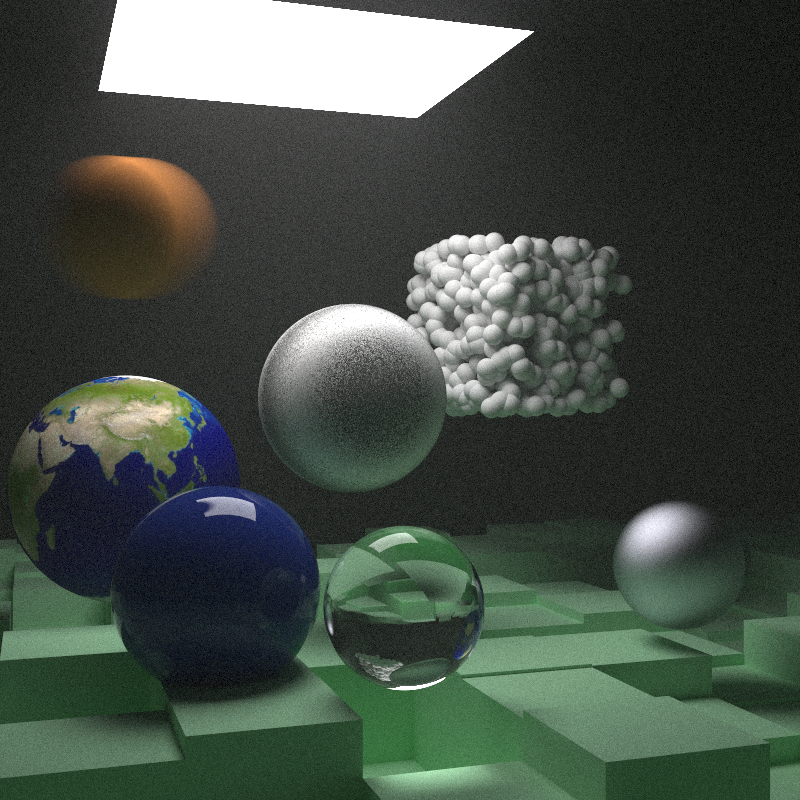
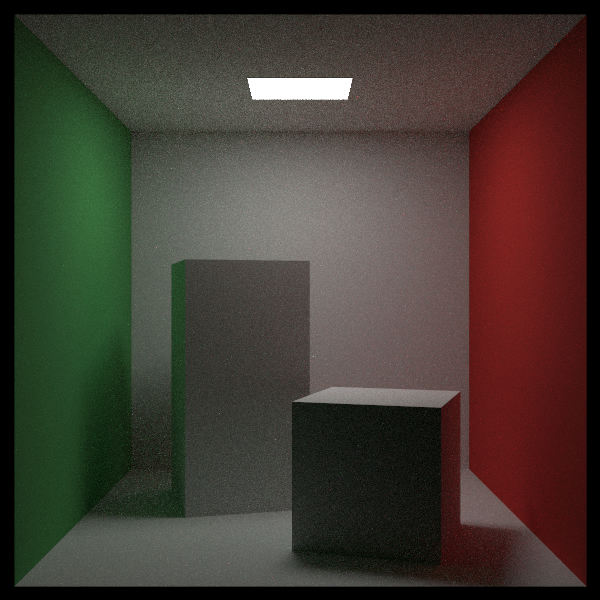
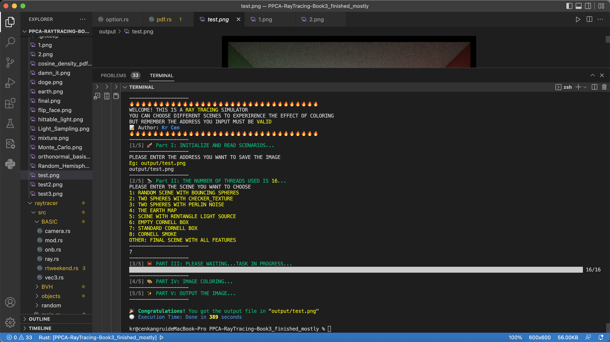

# Kr's RayTracer

## Intro

- Author：Kr Cen from SJTU, 21级JOHN班
- 2021-2022暑期小学期项目（小PPCA:joy:）
- template from https://github.com/Mighty-A/raytracer-tutorial
- 鸣谢助教叶哥 [Mighty-A](https://github.com/Mighty-A) 与我深夜激情debug（bushi

## Work Done

- [x] 基本实现 [Ray Tracing in One Weekend 系列教程](https://raytracing.github.io/) Book1~3
- [x] 正确渲染所有checkpoints
- 提高代码质量

  - [x] 整理源文件结构
  - [x] 规范变量命名
  - [x] 实现 `Transform` 类的 PDF 功能
  - [x] 使用 GitHub Action，创建了相关branches
  - [x] 提供较友好的控制台 UI 界面
  - [x] 支持多线程，采用progressingbar进度条
  - [x] 以自定义质量因子的 `JPEG` 格式输出渲染结果，平衡图像大小与质量
  - [ ] 支持从 `obj` 格式文件输入场景
  - [ ] 支持从 `yaml` 或 `JSON` 文件读取场景并生成对应的静态 BVH 数据
  - [ ] 使用 `criterion crate` 实现基准测试 (Benchmark)，用于比较不同版本代码的差异

## 渲染效果

## Some details

* 通过一个月相对高强度的Rust学习与Coding，第一次体验到做一个完整项目的小小成就感与乐趣。同样涉及计算机图形学领域，RayTracer在视觉效果上给人带来的愉悦，远远大于大一第一学期的Histogram Equalization。

Enlightening：

* Book3降噪处理效果显著，前后对比

* MultiThread实现

~~~Rust
for thread_id in 0..n_jobs {
        let line_beg = section_line_num * thread_id;
        let line_end = if line_beg + section_line_num > image_height || (thread_id == n_jobs - 1 && line_beg + section_line_num < image_height) {
            image_height
        } 
        else {
            line_beg + section_line_num
        };

        let (tx, rx) = mpsc::channel();
        let camera_clone = cam.clone();
        let mut world_clone = world.clone();
        let lights_clone = lights.clone();
        thread_pool.push_back((
            thread::spawn(move || {
                let channel_send = tx.clone();

                let mut section_pixel_color = Vec::<Vec3>::new();

                for j in line_beg..line_end {
                    for i in 0..image_width {
                        let mut pixel_color = Vec3::zero();
                        // take samples_per_pixel samples and average them
                        for _s in 0..samples_per_pixel {
                            let u = (i as f64 + BASIC::rtweekend::random_double_1()) / (image_width as f64);
                            let v = (j as f64 + BASIC::rtweekend::random_double_1()) / (image_height as f64);
                            let mut r = camera_clone.get_ray(u, v);
                            pixel_color += ray_color(&mut r, &mut background, &world_clone, lights_clone.clone(), MAX_DEPTH);
                        }
                        section_pixel_color.push(pixel_color);
                    }
                }
                channel_send.send(section_pixel_color).unwrap();
                // progress_bar.finish_with_message("Finished.");
            }),
            rx,
        ));
}
~~~

* 友好的Terminal交互界面

Deficiency：

* 缺乏对建模原理更深的理解，没能基于教程的算法进行矫正或优化
* 对Rust语法掌握的不够系统，bug层出不穷（
* 一些函数的常数较大，可能添加了一些非必要的clone()

~~~Rust
//==================守护Rust最好的螃蟹====================//
/*
                          \\/
     ▒▒          ▒▒▒▒▒▒▒▒      ▒▒▒▒▒▒▒▒          ▒▒
   ▒▒▒▒  ▒▒    ▒▒        ▒▒  ▒▒        ▒▒    ▒▒  ▒▒▒▒
   ▒▒▒▒  ▒▒  ▒▒            ▒▒            ▒▒  ▒▒  ▒▒▒▒
 ░░▒▒▒▒░░▒▒  ▒▒            ▒▒            ▒▒  ▒▒░░▒▒▒▒
   ▓▓▓▓▓▓▓▓  ▓▓      ▓▓██  ▓▓  ▓▓██      ▓▓  ▓▓▓▓▓▓▓▓
     ▒▒▒▒    ▒▒      ████  ▒▒  ████      ▒▒░░  ▒▒▒▒
       ▒▒  ▒▒▒▒▒▒        ▒▒▒▒▒▒        ▒▒▒▒▒▒  ▒▒
         ▒▒▒▒▒▒▒▒▒▒▓▓▓▓▓▓▒▒▒▒▒▒▒▒▓▓▒▒▓▓▒▒▒▒▒▒▒▒
           ▒▒▒▒▒▒▒▒▒▒▒▒▒▒▒▒▒▒▒▒▒▒▒▒▒▒▒▒▒▒▒▒▒▒
             ▒▒▒▒▒▒▒▒▒▒██▒▒▒▒▒▒██▒▒▒▒▒▒▒▒▒▒
           ▒▒  ▒▒▒▒▒▒▒▒▒▒██████▒▒▒▒▒▒▒▒▒▒  ▒▒
         ▒▒    ▒▒▒▒▒▒▒▒▒▒▒▒▒▒▒▒▒▒▒▒▒▒▒▒▒▒    ▒▒
       ▒▒    ▒▒    ▒▒▒▒▒▒▒▒▒▒▒▒▒▒▒▒▒▒    ▒▒    ▒▒
       ▒▒  ▒▒    ▒▒                  ▒▒    ▒▒  ▒▒
           ▒▒  ▒▒                      ▒▒  ▒▒
*/
//======================================================//
~~~

## Module Tree

- **create**
  - `scene`
  - **basic**
    - `camera`, `ray`, `vec3`, `onb`, `rtweekend`
  - **hittable**
    - `obj_model`
    - **instance**
      - `Translate`, `Rotate`, `ConstantMedium`
    - **object**
      - `Sphere`, `rectangle`, `Box`
  - **bvh**
    - `aabb`, `bvh_node`
  - **material**
    - `lambertian`, `metal`, `dielectric`, `diffuse_light`, `isotropic`
  - **pdf**
    - `CosinePdf`, `HittablePdf`
  - **texture**
    - `solid_color`, `image_texture`, `checker_texture`, `noise_texture`

## Tutorial from ACM

工科和ACM的朋友们都已结课！看看这些了不起的艺术品：

- [工科](https://github.com/aik2mlj/raytracer-tutorial/issues/1)
- [ACM](https://github.com/aik2mlj/raytracer-tutorial/issues/2)

---

ACM伪摄影公司，简称PPCA，于2021年成立😉

这个项目的主要工作是使用Rust语言实现一个光线追踪渲染器。以这个形式，你能通过学习一门新的（而且漂亮的）语言来加深对编程语言设计、编译原理的理解，同时又能趣味性地了解Computer Graphics的基础工作。

今年我们增设了作品互评环节。使用自己手写的渲染器，发挥艺术才能，创造出惊艳全场的超现实大作吧！

主要参考资料如下：
- [The Rust Programming Language](https://doc.rust-lang.org/book/title-page.html)
- [Ray Tracing in One Weekend - The Book Series](https://raytracing.github.io)

更多的参考资料信息在下方的Reference版块中。

你可以直接点击右上角的“Use this template”将这个项目复制到自己的 GitHub Profile 中。接下来，你需要做一些准备工作。

### Task 0: Preparation

* 在 `raytracer/Cargo.toml` 中，修改作者信息。
* 在 `LICENSE` 中，将作者修改为自己。你也可以换成其他许可证。
* 使用 [rustup 安装 Rust](https://doc.rust-lang.org/book/ch01-01-installation.html)。如果下载速度很慢，可以考虑使用 [SJTUG Mirror](https://mirrors.sjtug.sjtu.edu.cn) 的 rust-static 和 crates.io 镜像。
* 之后，你需要安装一些工具。首先，你需要定位到项目目录。而后，运行 `rustup component add clippy rustfmt`
* 接着，运行 `make ci`。如果程序可以正常运行，那么环境就已经配置成功了。
* 将这些更改 push 到 GitHub 上。在 GitHub Action 中，“Lint and Test”和“Build and Upload”都应当通过。
* 程序生成的结果会出现在 GitHub Action 的 artifacts 中。output 文件夹下的内容应当是程序运行时生成的。
  对 output 文件夹的修改不应该被同步到 GitHub 上（这个文件夹在 `.gitignore` 中有设置，会被 git 忽略）。
* 最后，你可以把 README.md 的教程部分删除，换成自己程序的描述、运行方法等信息。

#### Task INF: Learn about Rust

我们希望在前一周的时间让大家熟悉Rust的语法。请阅读Rust书（或者你认为合适的教程）学习。
* 通常来说，你只需要用到前 6 章和第 10.2 节的内容。
* 如果碰到了 lifetime 相关的问题，请仔细阅读第 4 章，特别是 4.2 的例子。
* 当然，你也可以通过第 15 章中的智能指针解决一部分 lifetime 导致的问题。
* Rust 的面向对象特性（trait，对应 C++ 的类）可以在 10.2 中找到。
* （Advanced）涉及到多线程渲染时，你可以阅读第 15、16 章的内容。

### Task 1: One Weekend

- Ray Tracing book 1，轻巧的一个周末。

- [x] code review（60pts for 工科，30pts for ACM）：第二周周一。
  - book 1相关细节
  - Rust特性掌握（简易，不超出要求章节外）

### Task 2: Next Week

- Ray Tracing book 2
- 多线程渲染

- [x] code review （仅工科，35pts for 工科&ACM）：第二周周五下午3点

  - 必须完成部分（20pts，未做完不得分）：BVH、Rectangles and Lights；其余部分视完成情况给分，封顶为book 2全部完成 + 多线程渲染。

  - book 2实现部分的相关细节，尤其是BVH部分，请务必尝试搞懂！
  - 工科同学结课🎉 作品互评🤯

### Task 3: Rest of Your Life & Extra work

- Ray Tracing book 3（20pts for ACM）
- Advanced features（Bonus, 10pts for ACM）
  - 完成3项track即可拿满
  - 如果你手写实现了obj_loader（没有调包），只要完成2项（包括Track 7）即拿满

- [x] code review：第四周周五
  - book 3相关细节
  - advanced features相关细节
  - ACM班同学结课🎉 作品互评🤯（5pts for ACM）

#### Advanced features
* **Track 1: Reduce Contention** 此项工作的前提条件是完成多线程渲染。在多线程环境中，clone / drop Arc 可能会导致性能下降。因此，我们要尽量减少 Arc 的使用。这项任务的目标是，仅在线程创建的时候 clone Arc；其他地方不出现 Arc，将 Arc 改为引用。
* **Track 2: Static Dispatch** 调用 `Box<dyn trait>` / `Arc<dyn trait>` / `&dyn trait` 中的函数时会产生额外的开销。我们可以通过泛型来解决这个问题。
  * 这个任务的目标是，通过定义新的泛型材质、变换和物体，比如 `LambertianStatic<T>`，并在场景中使用他们，从而减少动态调用的开销。你也可以另开一个模块定义和之前的材质同名的 struct。
  * 你可以在 `material.rs` 里找到泛型的相关用法。
  * 仅在 `HitRecord`, `ScatterRecord` (这个在 Rest of Your Life 的剩余部分中出现), `HittableList` 和 `BVHNode` 中使用 `dyn`。
  * 如果感兴趣，可以探索如何使用 `macro_rules` 来减少几乎相同的代码写两遍的冗余。
* **Track 3: Code Generation** 此项工作的前提条件是完成 BVH。
  * 目前，`BVHNode` 是在运行时构造的。这个过程其实可以在编译期完成。我们可以通过过程宏生成所有的物体，并构造静态的 `BVHNode`，从而提升渲染效率。
  * `raytracer_codegen`和`raytracer`大概是不能共用module的，你可能需要把一些实现（如`Vec3`）简单地copy到`raytracer_codegen`下。
  * 你可以使用 `cargo expand` 来查看过程宏处理过后的代码。你也可以在编译过程中直接输出过程宏生成的代码。
  * `codegen` 部分不需要通过 clippy。
  * 如果感兴趣，你也可以探索给过程宏传参的方法。e.g. 通过 `make_spheres_impl! { 100 }` 生成可以产生 100 个球的函数。
* **Track 4: PDF Static Dispatch** 此项工作的前提条件是完成 Rest of your Life 的剩余部分。PDF 中需要处理的物体使用泛型完成，去除代码路径中的 `&dyn`。
* **Track 5: More Code Generation** 在过程宏中，读取文件，直接从 yaml 或 JSON 文件（选择一种即可）生成场景对应的程序。
  * 在 `data` 文件夹中给出了一些例子。
  * 例子中 `BVHNode` 里的 `bounding_box` 是冗余数据。你可以不使用这个数据。
  * 读 JSON / yaml 可以调包。
* **Track 6: Advanced Features** 增加对 Transform 的 PDF 支持。
* 如果你有多余的时间，你可以通过 benchmark 来测试实现功能前后的区别。
  * 完成 Track 3 前请备份代码 (比如记录 git 的 commit id)。完成 Track 4, 5, 6 时请保留原先的场景和程序，在此基础上添加新的内容。
  * 你可以使用 `criterion` crate 做 benchmark。benchmark 的内容可以是往构造好的场景中随机打光线，记录打一条光线所需的时间。
* **Track 7: Support for .obj** 支持载入obj文件并渲染。完成这一部分你可能需要：
  
  * 了解obj文件格式
  * 实现一个obj_loader
    * 可调包，如tobj
    * OBJ文件格式和tobj可参考[参考资料](https://docs.rs/tobj/3.0.1/tobj/)或自行搜索
  * 实现对简单多边形的渲染
  * 支持obj可以让你最后的大作更精彩哦 :)                 图源参考资料↓
  
  

### More Information

#### Makefile

`Makefile` 中包含了运行 raytracer 的常用指令。如果没有安装 `make`，你也可以直接运行 `cargo balahbalah`。

* `make fmt` 会自动格式化所有的 Rust 代码。
* `make clippy` 会对代码风格做进一步约束。
* `make test` 会运行程序中的单元测试。你编写的 `Vec3` 需要通过所有测试。
* `make run_release` 会运行优化后的程序。通常来说，你需要用这个选项运行 raytracer。否则，渲染会非常慢。
* `make run` 以 debug 模式运行程序。
* `make ci` = `fmt + clippy + test + run_release`。建议在把代码 push 到远程仓库之前运行一下 `make ci`。

### GitHub Action

这个仓库已经配置好了 GitHub Action。只要把代码 push 到远程仓库，GitHub 就会进行下面两个检查。

* **Lint and Test** 会运行所有单元测试，并检查代码风格。
* **Build and Upload** 会运行优化后的程序，并将 output 目录下生成的文件传到 build artifacts 中。

### Reference

* [The Rust Programming Language](https://doc.rust-lang.org/book/title-page.html)
* [rustlings](https://github.com/rust-lang/rustlings) 包含许多 Rust 小练习。如果你希望通过练习来学习 Rust 语言，可以尝试一下这个参考资料。
* [Ray Tracing in One Weekend — The Book Series](https://raytracing.github.io)
* （Advanced）过程宏相关
  * [Procedural Macros](https://doc.rust-lang.org/reference/procedural-macros.html) (关注 Function-like procedural macros 即可)
  * [quote crate](https://crates.io/crates/quote)
* （Advanced）JSON / yaml 读取
  * [serde-json](https://docs.serde.rs/serde_json/)，只需要关注其中的 untyped 部分。
  * [yaml-rust](https://docs.rs/yaml-rust/0.4.4/yaml_rust/)
  * 通常来说，你并不需要使用到下面这个序列化/反序列化的包。
  * [serde](https://serde.rs)

## My Reference

* https://raytracing.github.io

* https://github.com/PaperL/Toy_Ray_Tracer/blob/master/README.md

* https://kaisery.github.io/trpl-zh-cn/title-page.html
